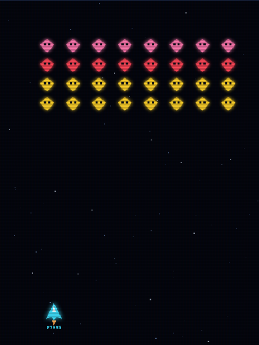
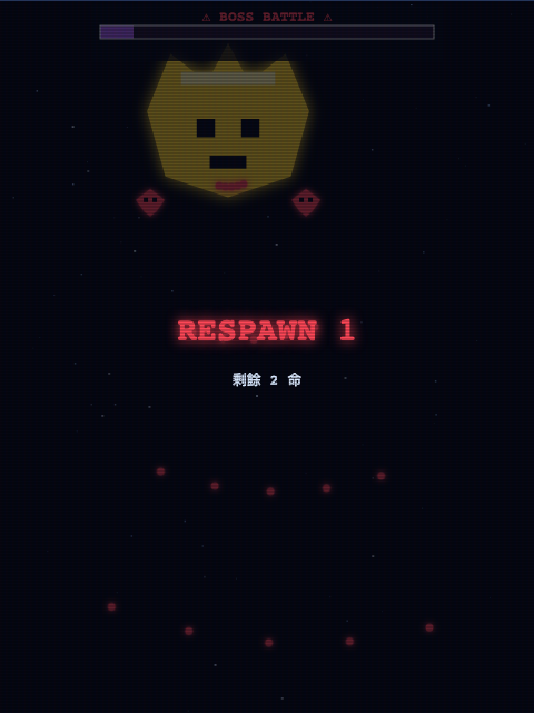
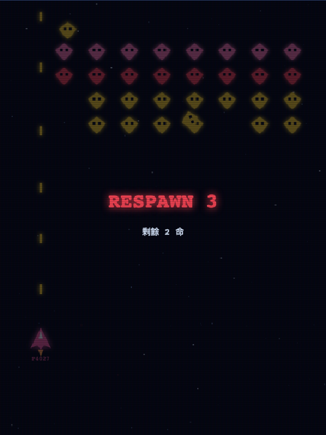
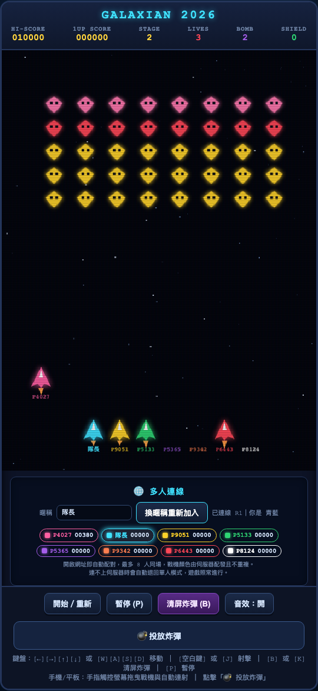

繁體中文 | [English](README.en.md)

# GALAXIAN 2026｜小蜜蜂 2D 射擊遊戲

一款在瀏覽器中遊玩的經典 2D 捲軸射擊遊戲，融合《小蜜蜂》的蜂群編隊與俯衝攻擊、《雷電》的火力升級與清屏炸彈，以及《兵蜂》的鈴鐺變色與能力強化機制。

## 遊戲介紹

- 操縱戰機閃避彈幕，擊落編隊中的敵機與俯衝中的蜜蜂。
- 擊中浮空鈴鐺可切換顏色，收集後可獲得分數、移動速度、火力、護盾或炸彈等強化。
- 火力升級後會開啟多向射擊與自動追蹤飛彈。
- 每 3 關進入 Boss 戰，首領會隨房內玩家人數調整強度。
- 開啟同一個服務網址即會自動配對，每房最多 8 人，並由伺服器配發不重複的戰機顏色。
- 若無法連上 WebSocket 伺服器，遊戲會自動切換為本地單人模式。

## 遊戲畫面

### 單人關卡



### Boss 戰



### 多人連線



### 8 人同場



## 服務啟動方式

### 環境需求

- Node.js（建議使用目前的 LTS 版本）
- npm

### 安裝與啟動

```bash
git clone https://github.com/isbrian/Game-Space-Invaders.git
cd Game-Space-Invaders
npm ci
npm start
```

伺服器預設會啟動於 [http://localhost:8080](http://localhost:8080)。使用瀏覽器開啟網址後即可遊玩；其他玩家連入同一個可存取的服務網址後，會自動進入房間。

如需更換連接埠，可在啟動時設定 `PORT`：

```bash
PORT=3000 npm start
```

房間與玩家數量可透過 [http://localhost:8080/stats](http://localhost:8080/stats) 查看。

## 遊戲操作方式

### 鍵盤

| 動作 | 按鍵 |
|------|------|
| 移動戰機 | 方向鍵或 `W` `A` `S` `D` |
| 射擊 | `Space` 或 `J` |
| 投放清屏炸彈 | `B` 或 `K` |
| 暫停／繼續 | `P` |
| 重新開始 | 點擊「開始／重新」 |

### 手機與平板

- 在遊戲畫面上按住並拖曳，戰機會跟隨手指移動並自動連射。
- 點擊「💣 投放炸彈」使用清屏炸彈。
- 可使用畫面下方的按鈕開始、暫停或切換音效。

## 開發與測試

```bash
npm test
```

瀏覽器端、多人連線與 8 人同場的端對端驗證位於 [test/browser_check.py](test/browser_check.py)。

## 授權

本專案採用 [Game-Space-Invaders Custom License](LICENSE)。你可以使用、複製與修改本專案，但須遵守授權條款。

若要散布未修改的原始版本（包含商業用途），必須保留原始著作權聲明與本授權條款。

若採用本專案並進行任何修改，之後只要要將**修改後的版本用於任何商業用途**，都必須事先取得著作權人的書面允許。此限制不以是否公開、販售或再次散布為限，也包含將修改後版本部署於商業服務、商業產品、授權給第三方使用，或其他營利活動。修改後版本若僅作非商業使用或非商業散布，則可依授權條款進行，但仍須保留原始著作權聲明與本授權條款。

完整條款請參閱 [LICENSE](LICENSE)。
